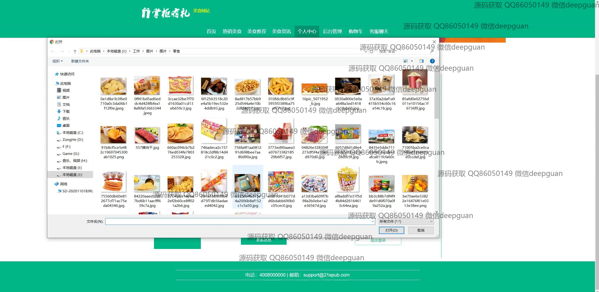
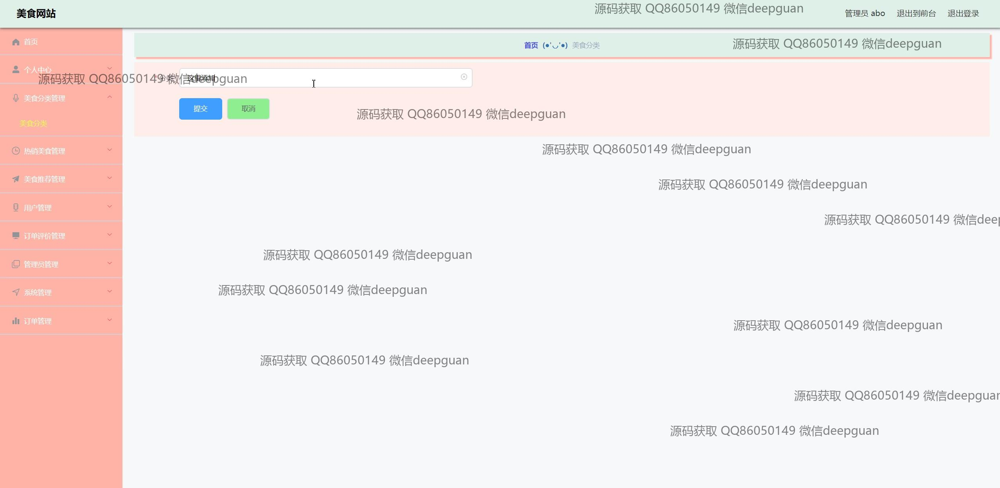

<h1 align="center">吃货美食推荐网站掌柜有礼vue</h1>

## 简介
吃货美食推荐网站掌柜有礼：角色分为管理员、用户；用户功能包括充值、浏览美食、购物、订单管理、个人中心；管理员功能涵盖用户管理、订单管理、美食分类管理、评价管理等。    --计算机毕业设计源码；毕设源码；java毕业设计源码

## 联系方式

<h3 align="center">获取完整代码与数据库文件 + 微信：deepguan QQ: 86050149 QQ群: 783742310</h3>

<h3 align="center">可帮忙远程部署 包运行成功！提供远程部署、修改代码、设计文档指导、代码讲解等服务！</h3>

## 功能介绍（完整见运行截图）
用户：基本功能包括注册、登录和退出，访问网站首页可以查看热门美食推荐、资讯、个人中心及购物车等功能。用户可以通过商品详情页面查看和购买美食，支持商品搜索、筛选，加入购物车与在线结算。个人中心提供订单查询、地址管理，还可以进行评论互动。  
管理员：管理员可通过后台管理界面管理美食分类、订单、用户信息及评价管理，支持编辑商品信息、处理订单及用户反馈。系统提供管理模块间切换功能，如用户管理、美食分类，帮助维护网站的正常运作，通过客服模块实时与用户交流。

## 运行截图

本代码来源于网络,仅供学习参考使用!

